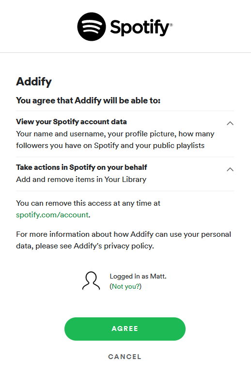
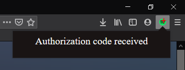
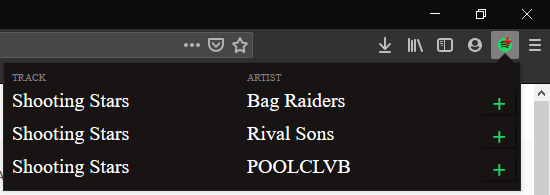
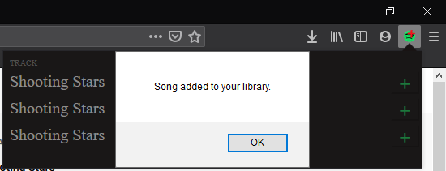
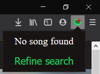

After installing the extension, click on the icon in your toolbar and you'll be redirected to a new tab. If you're not logged into Spotify, it'll
prompt you to do so now. If you are logged in, Spotify will ask you if you want to allow Addify access to your account data and to modify your song library.

Clicking agree will bring you to the Spotify homepage. You can exit the tab. Click on the icon again which will take you to the homepage to get the authentication code. After seeing the image below, you can exit the tab again.

From now on, when you have a Youtube video open, clicking on the icon will get the video title, search Spotify with it,
and return results to the popup.

Clicking on the green plus will add that song to your library.

If Spotify returns no results back, you'll see the below image. Clicking 'Refine Search'
will take the Youtube video title and remove any text within brackets or parentheses and search Spotify again.

If again no results are found, you'll be met with the same 'No song found' text. So either Spotify doesn't have the song or the video title was too convoluted for the extension to handle.
